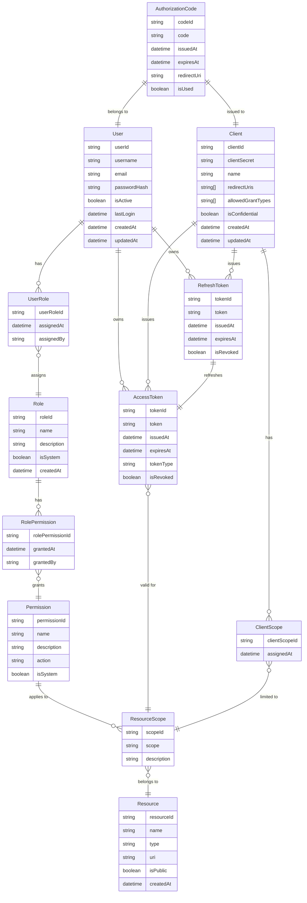

```mermaid
erDiagram
    User ||--o{ UserRole : has
    User ||--o{ AccessToken : owns
    User ||--o{ RefreshToken : owns
    User {
        string userId
        string username
        string email
        string passwordHash
        boolean isActive
        datetime lastLogin
        datetime createdAt
        datetime updatedAt
    }

    UserRole }o--|| Role : assigns
    UserRole {
        string userRoleId
        datetime assignedAt
        string assignedBy
    }

    Role ||--o{ RolePermission : has
    Role {
        string roleId
        string name
        string description
        boolean isSystem
        datetime createdAt
    }

    RolePermission }o--|| Permission : grants
    RolePermission {
        string rolePermissionId
        datetime grantedAt
        string grantedBy
    }

    Permission ||--o{ ResourceScope : "applies to"
    Permission {
        string permissionId
        string name
        string description
        string action
        boolean isSystem
    }

    Client ||--o{ AccessToken : issues
    Client ||--o{ RefreshToken : issues
    Client {
        string clientId
        string clientSecret
        string name
        string[] redirectUris
        string[] allowedGrantTypes
        boolean isConfidential
        datetime createdAt
        datetime updatedAt
    }

    AccessToken }o--|| ResourceScope : "valid for"
    AccessToken {
        string tokenId
        string token
        datetime issuedAt
        datetime expiresAt
        string tokenType
        boolean isRevoked
    }

    RefreshToken ||--|| AccessToken : refreshes
    RefreshToken {
        string tokenId
        string token
        datetime issuedAt
        datetime expiresAt
        boolean isRevoked
    }

    ResourceScope }o--|| Resource : "belongs to"
    ResourceScope {
        string scopeId
        string scope
        string description
    }

    Resource {
        string resourceId
        string name
        string type
        string uri
        boolean isPublic
        datetime createdAt
    }

    Client ||--o{ ClientScope : has
    ClientScope }o--|| ResourceScope : "limited to"
    ClientScope {
        string clientScopeId
        datetime assignedAt
    }

    AuthorizationCode ||--|| User : "belongs to"
    AuthorizationCode ||--|| Client : "issued to"
    AuthorizationCode {
        string codeId
        string code
        datetime issuedAt
        datetime expiresAt
        string redirectUri
        boolean isUsed
    }
```
