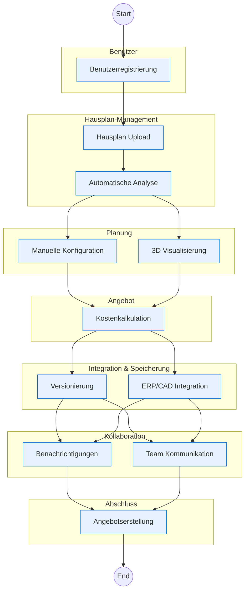

# Requirements Flow

```mermaid
flowchart TD
    %% Style definitions
    classDef mandatory fill:#E6F3FF,stroke:#0066CC
    classDef optional fill:#F0F0F0,stroke:#808080

    %% Start node
    Start((Start))

    %% Benutzer subgraph
    subgraph Benutzer
        B1[Benutzerregistrierung]
    end

    %% Hausplan-Management subgraph
    subgraph Hausplan-Management
        H1[Hausplan Upload]
        H2[Automatische Analyse]
    end

    %% Planung subgraph
    subgraph Planung
        P1[Manuelle Konfiguration]
        P2[3D Visualisierung]
    end

    %% Angebot subgraph
    subgraph Angebot
        A1[Kostenkalkulation]
    end

    %% Integration & Speicherung subgraph
    subgraph Integration & Speicherung
        I1[Versionierung]
        I2[ERP/CAD Integration]
    end

    %% Kollaboration subgraph
    subgraph Kollaboration
        K1[Benachrichtigungen]
        K2[Team Kommunikation]
    end

    %% Abschluss subgraph
    subgraph Abschluss
        AB1[Angebotserstellung]
    end

    %% End node
    End((End))

    %% Flow connections
    Start --> B1
    B1 --> H1
    H1 --> H2
    H2 --> P1 & P2
    P1 & P2 --> A1
    A1 --> I1 & I2
    I1 & I2 --> K1 & K2
    K1 & K2 --> AB1
    AB1 --> End

    %% Apply styles
    class B1,H1,H2,P1,P2,A1,I1,I2,K1,K2,AB1 mandatory
```

## Legend
- Blue background: Mandatory steps
- Gray background: Optional steps
