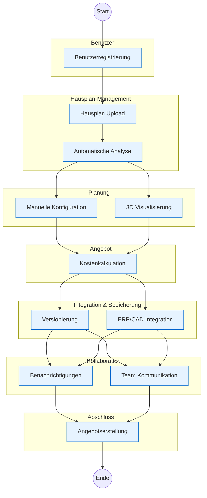
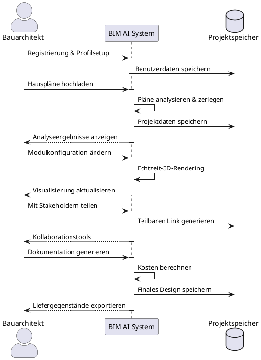

# BIM AI System Anforderungsanalyse

Dieses Dokument bietet einen umfassenden Überblick über die BIM AI System-Anforderungen, einschließlich des Anforderungsflusses und der detaillierten Benutzerreise-Analyse.

## Anforderungsfluss

Das folgende Diagramm veranschaulicht den Kernprozessfluss des Systems:

## Detaillierte Anforderungsmatrix

| Kategorie | Funktionale Schnittstellen | Frontend-Anforderungen | Nicht-funktionale Anforderungen |
|----------|---------------------|----------------------|---------------------------|
| Benutzerregistrierung & -verwaltung | - Rollen- und Berechtigungssystem (Pflicht) - Benutzerprofilverwaltung (Pflicht) | - Registrierung/Login-Oberfläche - Rollenbasierte Benutzeroberfläche | - Sicherheit: Verschlüsselung, Authentifizierung - DSGVO-Konformität |
| Hausplan-Upload & Analyse | - PDF/CAD-Upload-Schnittstellen (Pflicht) - Planzerlegungsalgorithmus (Pflicht) | - Upload-UI mit Fortschrittsanzeige - Analyseergebnis-Visualisierung | - Optimierte Analysealgorithmen - Zuverlässige Dateiverarbeitung |
| Manuelle Planung & Konfiguration | - Drag-and-Drop-Modulschnittstellen (Optional) | - Interaktive Planungsoberfläche - Echtzeit-Visualisierung | - Intuitive Bedienbarkeit - Skalierbarkeit für komplexe Pläne |
| 3D-Visualisierung & VR | - 3D-Rendering-Engine-APIs (Optional) | - 3D-Vorschauansicht - Virtuelle Hausführungen | - Schnelle Ladezeiten - Zuverlässige Datenverarbeitung |
| Kostenschätzung & Angebote | - Automatische Kostenberechnung (Pflicht) | - Angebotserstellung/Bearbeitung-UI - PDF-Export | - Parallele Angebotsverarbeitung |
| Planspeicherung & -abruf | - Planversionierungs-Schnittstellen (Pflicht) | - Gespeicherte Pläne-Verwaltung UI | - Backup und Wiederherstellung |
| Kollaborationsfunktionen | - Chat/Kommentar-Schnittstellen (Optional) | - Echtzeit-Kommunikations-UI | - Minimale Ausfallzeiten |
| Benachrichtigungssystem | - E-Mail/Push-Benachrichtigungs-Schnittstellen (Optional) | - Benachrichtigungseinstellungen-UI | - Hohe Nachrichtenvolumen-Verarbeitung |
| Integrationen | - CAD-Software-Schnittstellen (Pflicht) - ERP/Produktions-APIs (Pflicht) | - | - Multi-Format-Interoperabilität |
| Sicherheit | - SSL, Auth-Maßnahmen (Pflicht) | - | - DSGVO-Konformität |

## Main Customer Journey

### Persona: Sarah Thompson
- **Rolle**: Senior Bauarchitektin
- **Erfahrung**: 12 Jahre in der Architekturplanung
- **Ziele**: 
    + Effiziente Umwandlung traditioneller Hauspläne in modulare Baukonzepte
    + Zusammenarbeit mit Kunden und Bauteams
    + Sicherstellung von Designgenauigkeit und Compliance

### Detaillierte Schritte

1. **Initialer Zugang & Einrichtung**
    + Registrierung im BIM AI System
    + Einrichtung des Berufsprofils mit Referenzen
    + Erhalt rollenspezifischer Berechtigungen

2. **Projektinitiierung**
    + Upload bestehender CAD/PDF-Hauspläne
    + System analysiert und zerlegt Pläne in Standardmodule
    + Überprüfung der initialen automatischen Analyse

3. **Design-Optimierung**
    - Feinabstimmung der Modulanordnung mittels Drag-and-Drop
    + Anpassung der Spezifikationen basierend auf Kundenanforderungen
    + Nutzung der 3D-Visualisierung zur räumlichen Validierung

4. **Zusammenarbeit & Überprüfung**
    + Teilen virtueller Rundgänge mit Kunden
    + Empfang und Umsetzung von Feedback durch integrierte Kommunikationstools
    + Zusammenarbeit mit Ingenieurteam bei technischen Spezifikationen

5. **Dokumentation & Lieferung**
    + Generierung von Kostenschätzungen basierend auf ausgewählten Modulen
    + Erstellung detaillierter technischer Dokumentation
    + Export finaler Pläne und Spezifikationen

### Customer-journey-Flussdiagramm

