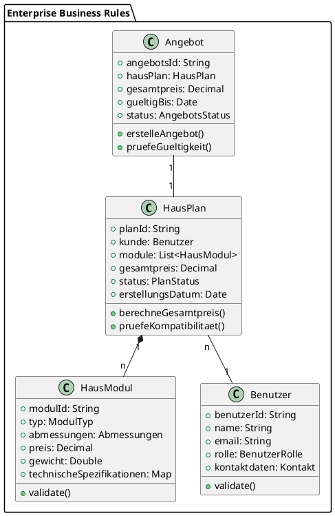
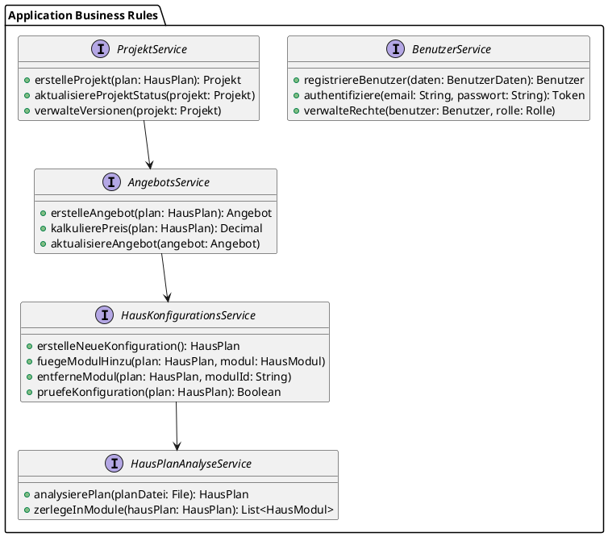
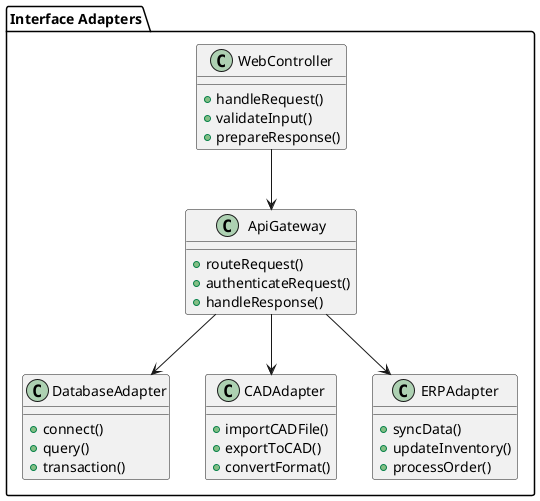
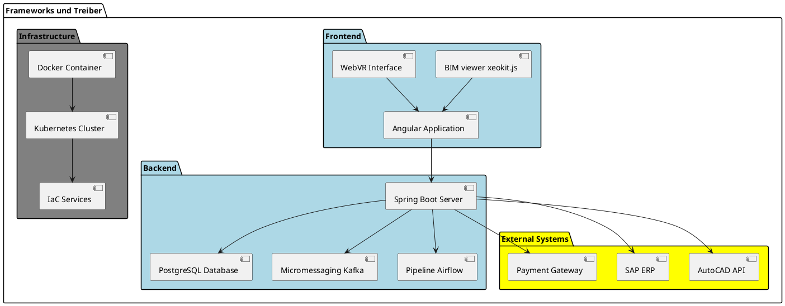

# Schritt-für-Schritt Designübersicht: ModularHaus Planungssystem

## 1. Analyse der Geschäftsanforderungen

### 1.1 Kerngeschäftsproblem
- Entwicklung einer Softwarelösung für die Planung und Konfiguration modularer Häuser
- Integration von 400 verschiedenen Standardmodulen
- Automatisierte Analyse bestehender Hauspläne
- Unterstützung für Kunden und Vertriebsmitarbeiter

### 1.2 Hauptgeschäftsziele
- Effizienzsteigerung im Planungsprozess
- Kosteneinsparungen durch standardisierte Module
- Verbesserte Kundenerfahrung
- Optimierung des Vertriebsprozesses

## 2. Clean Architecture Schichten

### 2.1 Enterprise Business Rules (Entities)
- Hausmodul-Entität
- Hausplan-Entität
- Benutzer-Entität
- Angebots-Entität

### 2.2 Application Business Rules (Use Cases)
- Hausplan-Analyse und Modularisierung
- Modulare Hauskonfiguration
- Angebotserstellung
- Benutzerverwaltung
- Projektmanagement

### 2.3 Interface Adapters
- Web-Controller
- API-Gateway
- Datenbank-Adapter
- CAD-System-Adapter
- ERP-System-Adapter

### 2.4 Frameworks und Treiber
- Cloud-native Framework
- Web-Frontend
- Datenbank-System
- CAD-Integration
- 3D-Visualisierung
- VR-System

## 3. Technische Anforderungsanalyse

### 3.1 Funktionale Anforderungen
#### Kernfunktionen
- Benutzerregistrierung und -authentifizierung
- Hausplan-Upload und -Analyse
- Modulare Planung und Konfiguration
- 3D-Visualisierung
- Angebotserstellung

#### Unterstützende Funktionen
- Versionskontrolle
- Kollaborative Funktionen
- Benachrichtigungssystem
- Dateiexport und -import

### 3.2 Nicht-funktionale Anforderungen
#### Technische Qualität
- Skalierbarkeit
- Performance
- Sicherheit
- Verfügbarkeit

#### Benutzerqualität
- Benutzerfreundlichkeit
- Reaktionsgeschwindigkeit
- Zuverlässigkeit

## 4. Systemintegration

### 4.1 Externe Schnittstellen
- CAD-Software-Integration
- ERP-System-Anbindung
- Zahlungssystem-Integration
- Cloud-Services-Anbindung

### 4.2 Datenaustausch
- API-Definitionen
- Datenformate
- Synchronisationsmechanismen
- Sicherheitsprotokolle

## 5. Qualitätssicherung

### 5.1 Teststrategien
- Unit-Tests
- Integrationstests
- End-to-End-Tests
- Performance-Tests

### 5.2 Monitoring und Wartung
- System-Monitoring
- Performance-Überwachung
- Fehlerprotokollierung
- Wartungsplanung

## 6. Sicherheitskonzept

### 6.1 Datenschutz
- DSGVO-Konformität
- Datenverschlüsselung
- Zugriffskontrollen
- Audit-Logging

### 6.2 Systemsicherheit
- Authentifizierung
- Autorisierung
- SSL/TLS-Verschlüsselung
- Backup-Strategien

## 7. Entwicklungsplanung

### 7.1 Implementierungsphasen
1. Grundlegende Systemarchitektur
2. Benutzer- und Rechteverwaltung
3. Hausplan-Upload und -Analyse
4. Modulare Planungsfunktionen
5. 3D-Visualisierung und VR
6. Integration externer Systeme

### 7.2 Ressourcenplanung
- Entwicklungsteams
- Hardware-Anforderungen
- Software-Lizenzen
- Cloud-Ressourcen

## 8. Risikomanagement

### 8.1 Technische Risiken
- Systemkomplexität
- Integrationsprobleme
- Performance-Engpässe
- Skalierungsprobleme

### 8.2 Geschäftsrisiken
- Marktakzeptanz
- Konkurrenzprodukte
- Regulatorische Änderungen
- Ressourcenverfügbarkeit

## 9. Erfolgskriterien

### 9.1 Technische Metriken
- System-Verfügbarkeit: 99.9%
- Maximale Antwortzeit: 2 Sekunden
- Gleichzeitige Benutzer: 1000+
- Datenverarbeitungsgeschwindigkeit

### 9.2 Geschäftsmetriken
- Benutzerakzeptanz
- Prozesseffizienz
- Kostenreduktion
- ROI-Ziele
