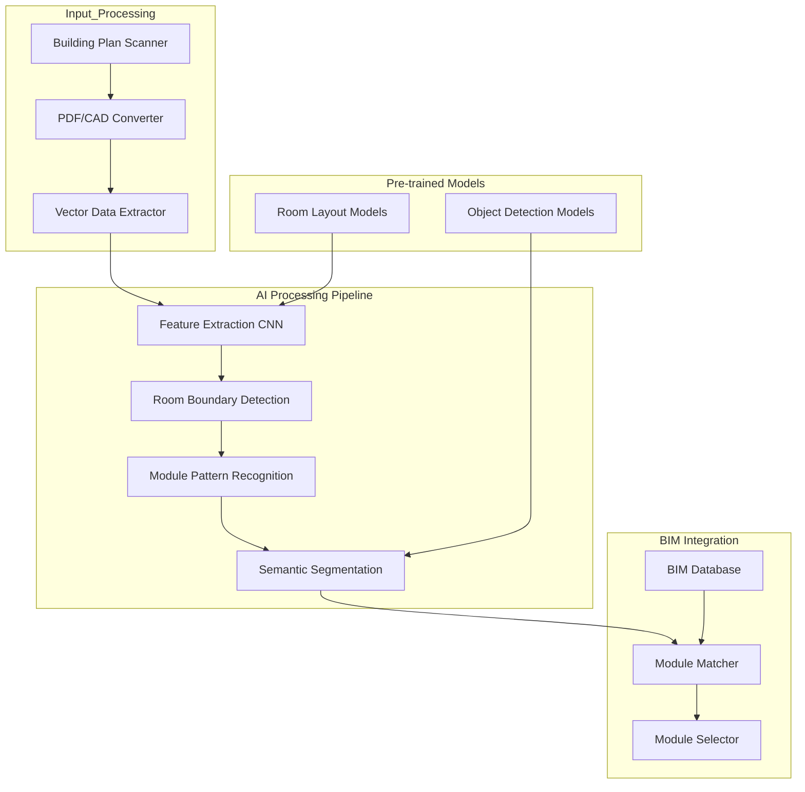
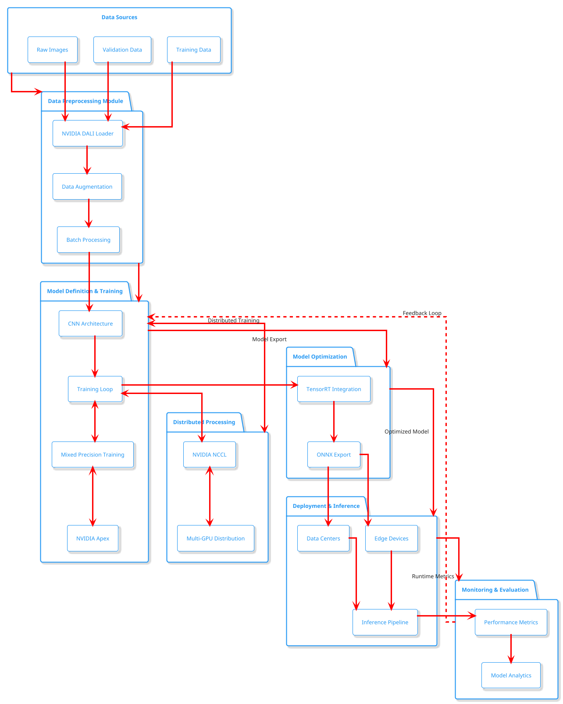

# BIM KI-Architektur

## Zusammenfassung
Die BIM KI-Architektur stellt ein hochentwickeltes System dar, das Computer Vision, maschinelles Lernen und domänenspezifisches Wissen kombiniert, um die Verarbeitung von Bauplänen und deren Integration in BIM-Systeme zu automatisieren. Diese Architektur ermöglicht die intelligente Analyse und Umwandlung verschiedener Bauplanformate in strukturierte BIM-Daten.

## Architektonische Entscheidungen

## Implementierungs- und Testerkenntnisse

### Hauptkomponenten

1. **Eingabeverarbeitung**
   - **Bauplan-Scanner**: Unterstützt mehrere Eingabeformate einschließlich:
     - PDF-Architekturpläne
     - CAD-Dateien (DWG, DXF)
     - Gescannte Baupläne
   - **PDF/CAD-Konverter**: Standardisiert verschiedene Eingabeformate
   - **Vektordaten-Extraktor**: Bereitet Daten für KI-Verarbeitung vor

2. **KI-Verarbeitungspipeline**
   - **Feature Extraction CNN**:
     - ResNet-Backbone-Architektur
     - Feature Pyramid Network
     - Instanz-Segmentierungsköpfe
   - **Raumgrenzen-Erkennung**: Identifiziert räumliche Grenzen
   - **Modul-Mustererkennung**: Erkennt wiederkehrende Muster
   - **Semantische Segmentierung**: Führt detaillierte Analysen durch, einschließlich:
     - Raumtyp-Klassifizierung
     - Wanderkennung
     - Tür-/Fensterkennung
     - Modul-Anforderungszuordnung

3. **BIM-Integration**
   - **Modul-Matcher**: Implementiert fortgeschrittenes Matching mittels:
     - Graph-Ähnlichkeitsabgleich
     - Analyse räumlicher Beziehungen
     - Modul-Kompatibilitätsprüfung
   - **BIM-Datenbank**: Speichert strukturierte Gebäudeinformationen
   - **Modul-Selektor**: Finalisiert die Modulauswahl

4. **Vortrainierte Modelle**
   - Raumlayout-Modelle: Spezialisiert auf räumliche Analyse
   - Objekterkennungsmodelle: Trainiert für Baukomponentenerkennung

### Design-Überlegungen

1. **Skalierbarkeit**
   - Modulare Pipeline-Architektur
   - Parallele Verarbeitungsmöglichkeiten
   - Verteilter KI-Modell-Einsatz

2. **Genauigkeit**
   - Mehrstufiger Verifizierungsprozess
   - Konfidenz-Bewertungssystem
   - Human-in-the-Loop-Validierungsoptionen

3. **Leistung**
   - Optimierte CNN-Architekturen
   - Effiziente Datenvorverarbeitung
   - Zwischenspeicherung von Zwischenergebnissen

4. **Integration**
   - Unterstützung von Standard-BIM-Formaten
   - API-First-Design
   - Erweiterbare Plugin-Architektur

### Teststrategie

1. **Unit-Tests**
   - Validierung einzelner Komponenten
   - KI-Modell-Leistungsmetriken
   - Integrationspunkt-Verifizierung

2. **System-Tests**
   - End-to-End-Pipeline-Validierung
   - Leistungs-Benchmarking
   - Fehlerbehandlungsszenarien

3. **Validierung**
   - Verfolgung von Genauigkeitsmetriken
   - Analyse falsch positiver/negativer Ergebnisse
   - Behandlung von Randfällen

### Detail ML-OPS Pipeline

