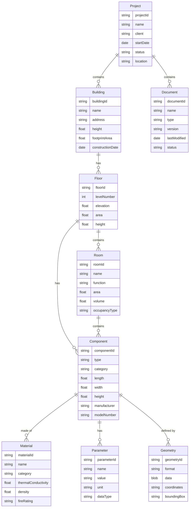

# BIM-Modell Übersicht

## Zusammenfassung
Das Building Information Model (BIM) stellt eine umfassende Datenstruktur zur Verwaltung von gebäudebezogenen Informationen dar. Dieses Modell unterstützt den gesamten Lebenszyklus von Bauprojekten, von der Planung und Konstruktion bis hin zur Wartung und dem Betrieb.

## Architektonische Entscheidungen

Das BIM-Modell folgt einer hierarchischen Struktur, die die natürliche Organisation von Gebäudeelementen widerspiegelt:

## Implementierungs- und Testerkenntnisse

[BIM Server implementierung open source](https://github.com/opensourceBIM/BIMserver)

### Wichtige Modellkomponenten

1. **Projektebene**
    - Übergeordneter Container für alle gebäudebezogenen Informationen
    - Verwaltung von Projektmetadaten und Dokumentation
    - Verfolgung des Gesamtprojektstatus und Zeitplans

2. **Gebäudestruktur**
    - Hierarchische Organisation von Gebäude zu Etagen zu Räumen
    - Detaillierte Verfolgung räumlicher Beziehungen
    - Umfassende Metadaten auf jeder Ebene

3. **Komponenten und Materialien**
    - Granulare Verfolgung von Gebäudekomponenten
    - Detaillierte Materialspezifikationen
    - Unterstützung für Hersteller- und Modellinformationen

4. **Parameter und Geometrie**
    - Flexibles Parametersystem für benutzerdefinierte Attribute
    - Umfassende Geometriedarstellung
    - Unterstützung verschiedener Datenformate und Koordinatensysteme

### Designüberlegungen

1. **Skalierbarkeit**
    - Modell unterstützt mehrere Gebäude pro Projekt
    - Flexibles Komponenten- und Parametersystem
    - Effiziente Handhabung großer Geometriedatensätze

2. **Interoperabilität**
    - Standarddatentypen für einfache Integration
    - Unterstützung gängiger BIM-Formate
    - Klare Beziehungsdefinitionen

3. **Datenintegrität**
    - Starke Beziehungsmodellierung
    - Umfassende Metadatenverfolgung
    - Versionskontrolle für Dokumente

4. **Erweiterbarkeit**
    - Benutzerdefinierte Parameter für spezifische Anforderungen
    - Flexible Geometriedarstellung
    - Unterstützung für zusätzliche Metadaten
