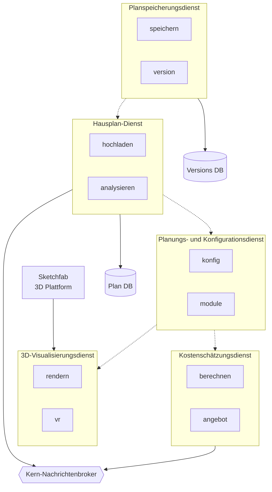

# Architektur der Kerngeschäftsdienste

## Zusammenfassung
Die Architektur der Kerngeschäftsdienste definiert die grundlegenden Dienste, die die Hauptfunktionalitäten des Systems antreiben. Diese Architektur betont Modularität, Skalierbarkeit und eine klare Trennung der Zuständigkeiten zwischen verschiedenen Geschäftsbereichen.

## Architektonische Entscheidungen

## Interne Dienstkomponenten

## Implementierungs- und Testerkenntnisse

### Überblick über die Kerndienste

1. **Hausplan-Dienst**
      - Planhochladen und -verarbeitung
      - Analyse und Validierung
      - Integration mit Konfigurationsdienst
      - Echtzeit-Updates über Nachrichtenbroker

2. **Planungs- und Konfigurationsdienst**
      - Modulverwaltung und -konfiguration
      - Durchsetzung von Planungsregeln
      - Konfigurationsvalidierung
      - Integration mit Visualisierungs- und Kostendiensten

3. **3D-Visualisierungsdienst**
      - Integration mit Sketchfab-Plattform
      - Echtzeit-3D-Modell-Rendering
      - VR/AR-Visualisierungsfähigkeiten
      - Leistungsoptimierung für webbasiertes 3D

4. **Kostenschätzungsdienst**
      - Echtzeitkostenberechnungen
      - Angebotserstellung
      - Preisaktualisierungen über Nachrichtenbroker
      - Konfigurationsbasierte Preisgestaltung

5. **Planspeicherungsdienst**
      - Versionskontrollverwaltung
      - Planspeicherung und -abruf
      - Verlaufsverfolgung
      - Backup und Wiederherstellung

### Infrastrukturkomponenten

1. **Datenbanken**
      - Plan-DB für primäre Speicherung
      - Versions-DB für Änderungsverfolgung
      - Optimiert für jeweilige Anwendungsfälle
      - Backup- und Replikationsstrategien

2. **Nachrichtenbroker**
      - Ereignisgesteuerte Architektur
      - Echtzeit-Updates
      - Dienst-Entkopplung
      - Skalierbare Nachrichtenverarbeitung
