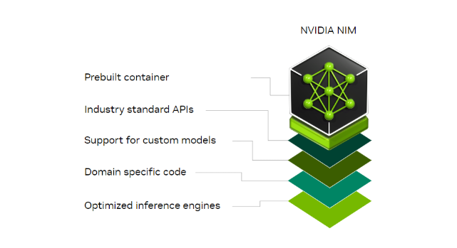
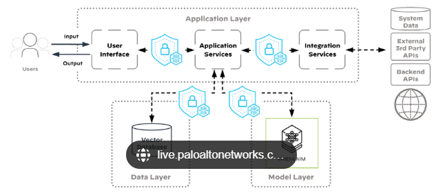
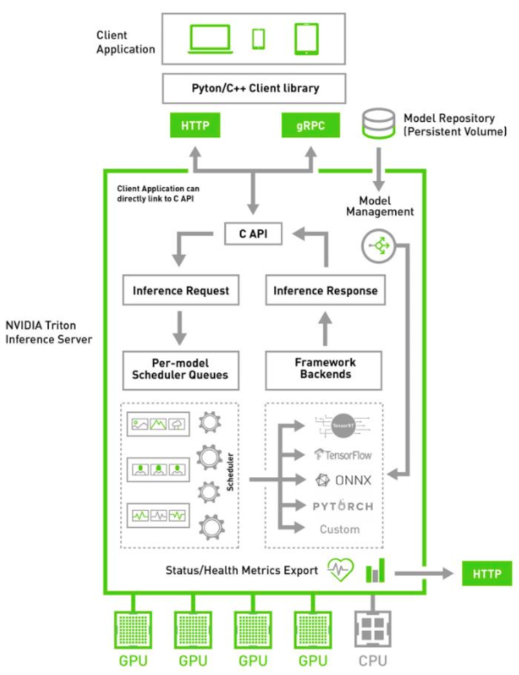

# NVIDIA NIM Framework für CNN-Entwicklung

Das NVIDIA NIM (Neural Information Modeler) Framework ist ein hochleistungsfähiges, modulares Werkzeug für die Entwicklung, das Training und die Bereitstellung von Deep-Learning-Modellen, einschließlich Convolutional Neural Networks (CNNs).

<figure markdown>
Quelle:NVIDIA Developer Program
</figure>

## Architektur und Module

### Datenvorverarbeitungsmodul

**Zweck**: Vorbereitung und Vorverarbeitung des Datensatzes für das Training.

**Komponenten**:
- Datensatz-Lader (Integration mit NVIDIA DALI für effiziente Datenverarbeitung)
- Vorverarbeitungspipelines (Skalierung, Rotation, Zuschneiden, etc.)
- Augmentierungstechniken (zufällige Spiegelungen, Helligkeitsanpassungen)

### Modelldefinitionsmodul

**Zweck**: Definition der CNN-Architektur unter Verwendung der Modellierungswerkzeuge des NIM-Frameworks.

**Komponenten**:
- Eingabeschicht für Bilder
- Faltungsschichten mit ReLU-Aktivierung
- Pooling-Schichten (Max-Pooling oder Average-Pooling)
- Vollständig verbundene Schichten für die Klassifizierung
- Dropout- und Batch-Normalisierungsschichten zur Überanpassungsprävention und Trainingsstabilität

### Trainingsmodul

**Zweck**: Handhabung von Modelltraining und Optimierung.

**Komponenten**:
- Verlustfunktionen (Cross-Entropy, MSE, etc.)
- Optimierer (SGD, Adam oder momentum-basierte Optimierer mit NVIDIA Apex für Mixed-Precision-Training)
- Lernraten-Scheduler für dynamische Anpassung
- Überwachungswerkzeuge (Tensorboard-ähnliche Funktionen)

<figure markdown>
Quelle:NVIDIA Developer Program
</figure>
### Inferenzmodul

**Zweck**: Optimierung des trainierten Modells für Inferenz und Bereitstellung auf unterstützter Hardware.

**Komponenten**:
- TensorRT-Integration für Hochleistungs-Inferenz
- Modellkonvertierungswerkzeuge für den Export in das ONNX-Format

<figure markdown>
Quelle:NVIDIA Developer Program
</figure>
### Verteiltes Trainingsmodul

**Zweck**: Skalierung des Trainings über mehrere GPUs oder Knoten.

**Komponenten**:
- NVIDIA NCCL für Multi-GPU-Kommunikation
- Unterstützung für Frameworks wie Horovod zur Verteilung von Berechnungen

### Evaluierungs- und Metrikmodul

**Zweck**: Bewertung der Modellleistung auf Testdatensätzen.

**Komponenten**:
- Rechner für Genauigkeit, Präzision, Recall und F1-Score
- Visualisierung der Konfusionsmatrix

## Programmiersprachen-Empfehlung

- **Python**: Hauptsprache für die Entwicklung
  - Umfangreiche Unterstützung für Deep-Learning-Bibliotheken (PyTorch, TensorFlow)
  - Integration mit NVIDIA-spezifischen Tools (CUDA, cuDNN, DALI)
- **C++**: Für leistungskritische Abschnitte und optimierte Bereitstellung

## NVIDIAs Skalierungskonzept

### Horizontale Skalierung (Datenparallelität)
- Verteilung des Modells über mehrere GPUs/Knoten
- Jede verarbeitet einen Teil der Daten
- Nutzt NVIDIA NCCL für schnelle Inter-GPU-Kommunikation

### Vertikale Skalierung (Modellparallelität)
- Aufteilung des Modells auf mehrere GPUs
- Verschiedene GPUs bearbeiten verschiedene Schichten/Teile
- Ideal für große Modelle, die den Speicher einer einzelnen GPU übersteigen

### Mixed-Precision-Training
- Nutzt NVIDIA Tensor Cores und Apex
- FP16-Präzision mit FP32 für kritische Berechnungen
- Reduziert Speicherverbrauch und verbessert Durchsatz

### Optimiertes Datenladen
- NVIDIA DALI für Vorverarbeitung
- Direkte GPU-Datenzuführung
- Minimiert CPU-Engpässe

### TensorRT für Inferenz
- Optimiert trainierte Modelle
- Bietet Quantisierung und Layer-Fusion
- Verbessert Geschwindigkeit und Speichereffizienz

## Hardware-Optionen

### GPUs für Training
- NVIDIA A100 (bis zu 80GB Speicher, MIG-Unterstützung)
- NVIDIA H100 (Modelle im Großmaßstab)
- NVIDIA RTX 4090 (kleine bis mittlere Modelle)

### GPUs für Inferenz
- NVIDIA T4 (Edge-Geräte und Inferencing)
- NVIDIA Jetson AGX Orin (eingebettete Systeme)

### Rechenzentrum-Hardware
- NVIDIA DGX-Systeme (vorkonfigurierte A100-Cluster)
- NVIDIA SuperPOD (Hyperscale-Training)

## Zusammenfassung

Das NVIDIA NIM Framework bietet ein umfassendes Ökosystem für CNN-Entwicklung, das Python/C++-Programmierung und Hardware-Beschleunigung nutzt. Die Skalierungsstrategien und Werkzeuge wie TensorRT und DALI optimieren sowohl die Trainings- als auch die Inferenzleistung. Die vielfältigen Hardware-Optionen ermöglichen Lösungen von Edge-Geräten bis hin zu Rechenzentren und machen es für verschiedene Einsatzszenarien anpassbar.
