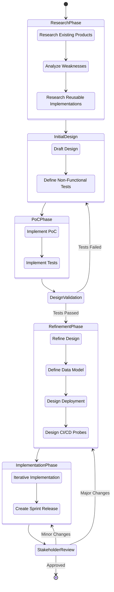

# Product Innovation Process

## Executive Summary
The Product Innovation Process defines a comprehensive approach to product development, from initial research through implementation and stakeholder approval. This structured process ensures thorough validation of ideas and designs before committing to full implementation.

## Process Overview

## Implementation and Process Insights

### 1. Research Phase
- **Research Existing Products**
  - Market analysis
  - Competitor feature comparison
  - User needs assessment
- **Analyze Weaknesses**
  - Gap analysis
  - Pain point identification
  - Improvement opportunities
- **Research Reusable Implementations**
  - Available technologies
  - Best practices
  - Integration possibilities

### 2. Initial Design
- **Draft Design**
  - High-level architecture
  - Component interactions
  - Technology stack selection
- **Define Non-Functional Tests**
  - Performance criteria
  - Scalability requirements
  - Security standards

### 3. Proof of Concept Phase
- **Implement PoC**
  - Core functionality
  - Critical features
  - Technical feasibility
- **Implement Tests**
  - Test automation
  - Performance benchmarks
  - Security validation

### 4. Design Validation
- Comprehensive testing
- Performance analysis
- Security assessment
- Architectural review

### 5. Refinement Phase
- **Refine Design**
  - Detailed architecture
  - Component specifications
  - Interface definitions
- **Define Data Model**
  - Schema design
  - Data relationships
  - Migration strategies
- **Design Deployment**
  - Infrastructure requirements
  - Scaling strategy
  - Monitoring approach
- **Design CI/CD Probes**
  - Quality gates
  - Automated checks
  - Deployment verification

### 6. Implementation Phase
- **Iterative Implementation**
  - Agile development
  - Continuous integration
  - Regular testing
- **Create Sprint Release**
  - Version control
  - Release notes
  - Deployment packages

### 7. Stakeholder Review
- Feature demonstration
- Performance metrics
- User feedback
- Approval process

## Process Benefits

1. **Risk Mitigation**
   - Early validation of concepts
   - Continuous stakeholder involvement
   - Iterative refinement

2. **Quality Assurance**
   - Comprehensive testing strategy
   - Regular validation points
   - Automated quality checks

3. **Efficiency**
   - Clear process flow
   - Defined decision points
   - Reusable components

4. **Flexibility**
   - Iterative development
   - Feedback incorporation
   - Adaptation capability
