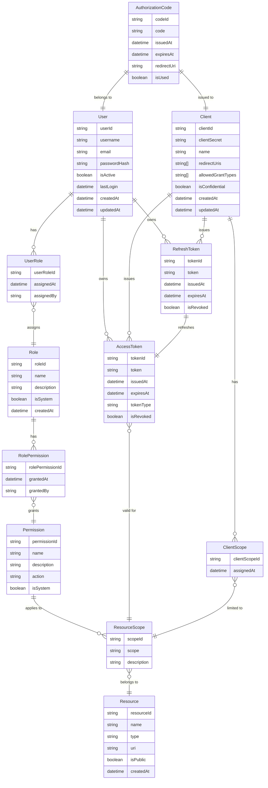

# OAuth2 Implementation Model

## Executive Summary
The OAuth2 implementation provides a robust security framework for authentication and authorization across the system. This model supports various OAuth2 grant types, role-based access control (RBAC), and fine-grained permission management through resource scopes.

## Architectural Choices

## Implementation and Testing Insights

### Core Components

1. **User Management**
   - Secure user authentication
   - Role-based access control
   - Activity tracking and auditing
   - Password hashing and security

2. **Role & Permission System**
   - Hierarchical role structure
   - Granular permission management
   - System and custom roles
   - Permission inheritance

3. **Token Management**
   - Access token generation and validation
   - Refresh token rotation
   - Token revocation
   - Scope-based access control

4. **Client Applications**
   - Client registration and management
   - Multiple grant type support
   - Redirect URI validation
   - Client scope restrictions

### Security Features

1. **Authentication**
   - Multiple grant type support:
     - Authorization Code
     - Client Credentials
     - Refresh Token
   - Secure token storage
   - Token expiration management

2. **Authorization**
   - Fine-grained resource access control
   - Scope-based permissions
   - Role-based access restrictions
   - Resource-level security

3. **Token Security**
   - Short-lived access tokens
   - Secure refresh token rotation
   - Token revocation capabilities
   - Scope validation

4. **Client Security**
   - Confidential client support
   - Redirect URI validation
   - Client scope restrictions
   - Client authentication

### Implementation Considerations

1. **Scalability**
   - Distributed token validation
   - Caching strategies
   - High availability design
   - Performance optimization

2. **Maintainability**
   - Clear separation of concerns
   - Modular architecture
   - Extensible design
   - Comprehensive logging

3. **Compliance**
   - OAuth2 specification adherence
   - Security best practices
   - Audit trail maintenance
   - Privacy considerations

### Testing Strategy

1. **Security Testing**
   - Token validation tests
   - Permission verification
   - Authentication flows
   - Security vulnerability scanning

2. **Performance Testing**
   - Token generation performance
   - Validation response times
   - Concurrent access handling
   - Cache effectiveness

3. **Integration Testing**
   - Client application integration
   - Grant type workflows
   - Token refresh scenarios
   - Error handling
