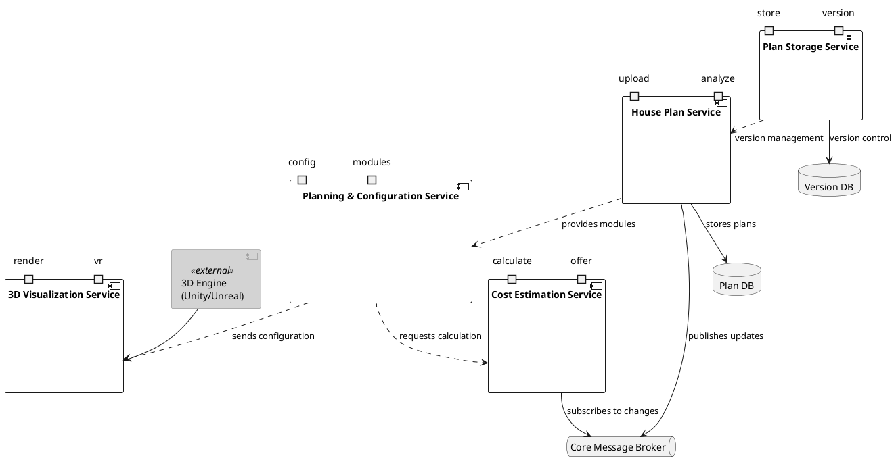
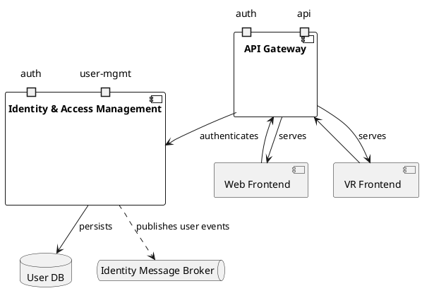
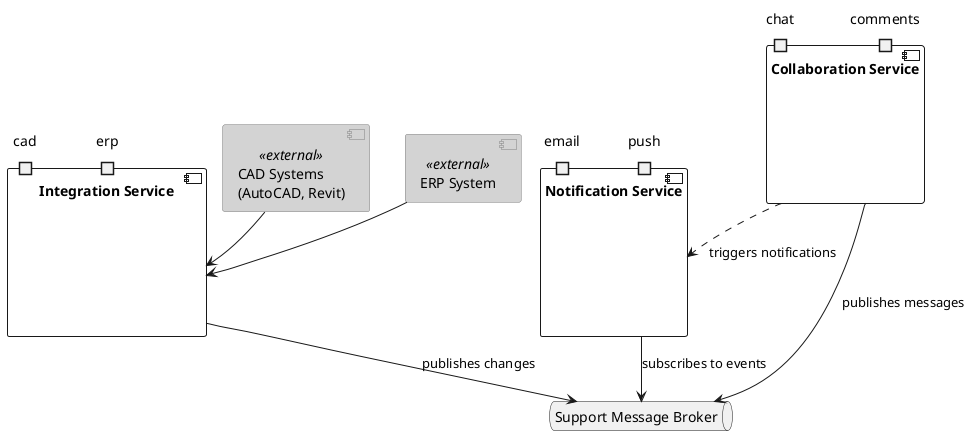

# Service Interface Architecture

This document provides a comprehensive overview of the system's service architecture, including core business services, gateway and identity management, and support services.

## Core Business Services Architecture

This layer handles the main functionality of the modular house planning system. It shows how different services interact to process house plans, manage configurations, provide visualizations, and calculate costs. The architecture uses a message broker for event-driven communication, ensuring loose coupling between services while maintaining data consistency across the platform.

## Gateway and Identity Architecture

This layer represents the security and access control layer of the system. It shows how the API Gateway manages all incoming requests and integrates with the Identity & Access Management service to ensure secure access to the platform. The architecture implements a robust authentication and authorization system, supporting both web and VR interfaces while maintaining centralized user management.

## Support Services Architecture

This layer outlines the architecture of the support services that facilitate collaboration, notification, and system integration within our platform. It ensures scalable, loosely coupled services that can evolve independently while maintaining robust communication channels.

### Components Description

#### Core Services
- **House Plan Service**: Manages upload and analysis of house plans
- **Planning & Configuration Service**: Handles module configuration and planning
- **3D Visualization Service**: Provides rendering and VR visualization capabilities
- **Cost Estimation Service**: Calculates costs and generates offers
- **Plan Storage Service**: Manages plan storage and versioning

#### Gateway and Identity Services
- **API Gateway**: Central entry point for all client requests
- **Identity & Access Management**: Handles authentication and user management
- **User DB**: Stores user information and credentials
- **Identity Message Broker**: Manages user-related events

#### Support Services
- **Collaboration Service**: Provides real-time chat and comment functionality
- **Notification Service**: Handles email and push notifications
- **Integration Service**: Manages external system integrations
- **Support Message Broker**: Enables asynchronous communication between services

### Communication Flow
1. All client requests go through the API Gateway for authentication
2. Core services communicate through the Core Message Broker
3. Support services use the Support Message Broker for asynchronous communication
4. External systems integrate through dedicated integration services
5. Services maintain loose coupling through event-driven architecture
