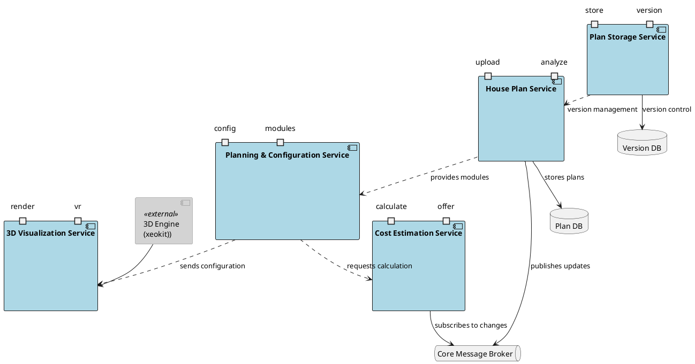
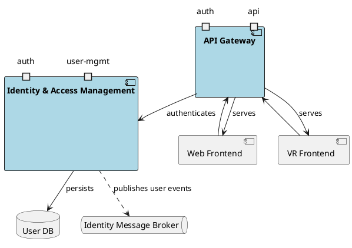
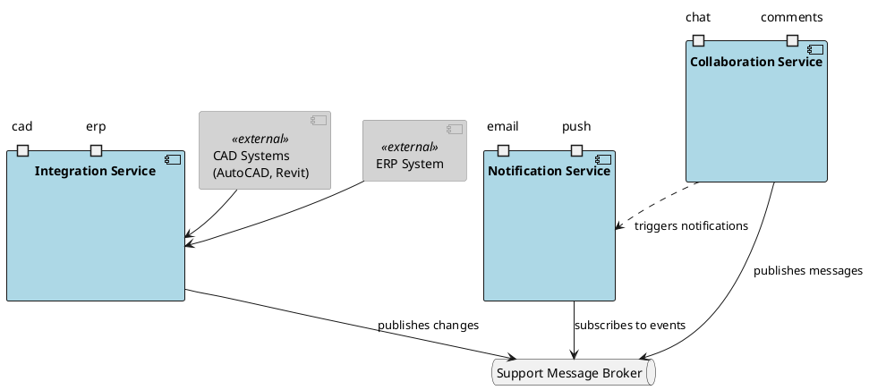

# Service-Schnittstellenarchitektur

Dieses Dokument bietet einen umfassenden Überblick über die Service-Architektur des Systems, einschließlich der Kern-Geschäftsdienste, Gateway- und Identitätsverwaltung sowie Unterstützungsdienste.

## Architektur der Kern-Geschäftsdienste

Diese Schicht behandelt die Hauptfunktionalität des modularen Hausplanungssystems. Sie zeigt, wie verschiedene Dienste zusammenarbeiten, um Hauspläne zu verarbeiten, Konfigurationen zu verwalten, Visualisierungen bereitzustellen und Kosten zu berechnen. Die Architektur verwendet einen Message Broker für ereignisgesteuerte Kommunikation und gewährleistet damit eine lose Kopplung zwischen den Diensten bei gleichzeitiger Datenkonsistenz über die gesamte Plattform.

## Gateway- und Identitätsarchitektur

Diese Schicht repräsentiert die Sicherheits- und Zugriffssteuerungsschicht des Systems. Sie zeigt, wie das API-Gateway alle eingehenden Anfragen verwaltet und mit dem Identitäts- und Zugriffsverwaltungsdienst integriert wird, um einen sicheren Zugriff auf die Plattform zu gewährleisten. Die Architektur implementiert ein robustes Authentifizierungs- und Autorisierungssystem, das sowohl Web- als auch VR-Schnittstellen unterstützt und gleichzeitig eine zentralisierte Benutzerverwaltung beibehält.

## Architektur der Unterstützungsdienste

Diese Schicht beschreibt die Architektur der Unterstützungsdienste, die die Zusammenarbeit, Benachrichtigung und Systemintegration innerhalb unserer Plattform ermöglichen. Sie gewährleistet skalierbare, lose gekoppelte Dienste, die sich unabhängig voneinander entwickeln können und dabei robuste Kommunikationskanäle aufrechterhalten.

### Komponentenbeschreibung

#### Kerndienste
- **House Plan Service**: Verwaltet das Hochladen und die Analyse von Hausplänen
- **Planning & Configuration Service**: Behandelt Modulkonfiguration und Planung
- **3D Visualization Service**: Bietet Rendering- und VR-Visualisierungsfähigkeiten
- **Cost Estimation Service**: Berechnet Kosten und erstellt Angebote
- **Plan Storage Service**: Verwaltet Planspeicherung und Versionierung

#### Gateway- und Identitätsdienste
- **API Gateway**: Zentraler Eingangspunkt für alle Client-Anfragen
- **Identity & Access Management**: Behandelt Authentifizierung und Benutzerverwaltung
- **User DB**: Speichert Benutzerinformationen und Anmeldedaten
- **Identity Message Broker**: Verwaltet benutzerbezogene Ereignisse

#### Unterstützungsdienste
- **Collaboration Service**: Bietet Echtzeit-Chat- und Kommentarfunktionalität
- **Notification Service**: Behandelt E-Mail- und Push-Benachrichtigungen
- **Integration Service**: Verwaltet externe Systemintegrationen
- **Support Message Broker**: Ermöglicht asynchrone Kommunikation zwischen Diensten

### Kommunikationsfluss
1. Alle Client-Anfragen durchlaufen das API-Gateway zur Authentifizierung
2. Kerndienste kommunizieren über den Core Message Broker
3. Unterstützungsdienste nutzen den Support Message Broker für asynchrone Kommunikation
4. Externe Systeme integrieren sich über dedizierte Integrationsdienste
5. Dienste behalten durch ereignisgesteuerte Architektur eine lose Kopplung bei
