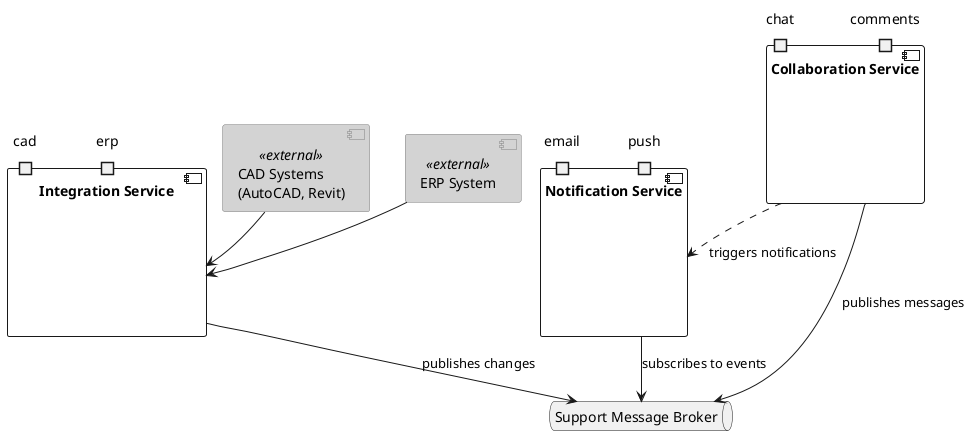

# Support Services Architecture

This document outlines the architecture of the support services that facilitate collaboration, notification, and system integration within our platform.

## Architecture Overview

## Components Description

### Core Services

1. **Collaboration Service**
   - Provides real-time chat functionality
   - Manages comment systems for collaborative work
   - Publishes user interaction messages to the message broker

2. **Notification Service**
   - Handles email notifications
   - Manages push notifications
   - Subscribes to events from the message broker to trigger notifications

3. **Integration Service**
   - Manages connections with external CAD systems
   - Handles ERP system integration
   - Publishes system changes to the message broker

### Infrastructure

- **Support Message Broker**
  - Central message queue for asynchronous communication
  - Enables loose coupling between services
  - Facilitates event-driven architecture

### External Systems

- **CAD Systems** (AutoCAD, Revit)
  - External design and modeling tools
  - Integrated through the Integration Service

- **ERP System**
  - External enterprise resource planning system
  - Connected through the Integration Service

## Communication Flow

1. External systems (CAD and ERP) communicate directly with the Integration Service
2. The Integration Service publishes changes to the Support Message Broker
3. The Notification Service subscribes to relevant events from the broker
4. The Collaboration Service can trigger notifications and publish messages to the broker
5. All services use the message broker for asynchronous communication

This architecture ensures scalable, loosely coupled services that can evolve independently while maintaining robust communication channels.
