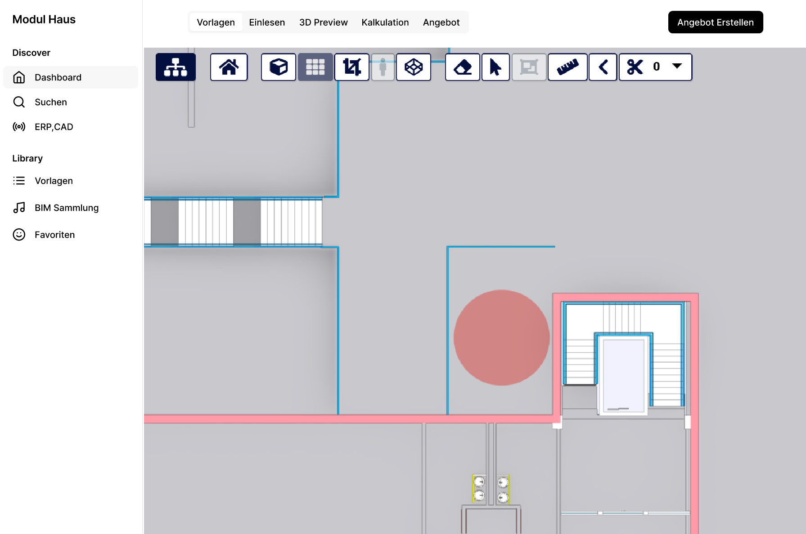
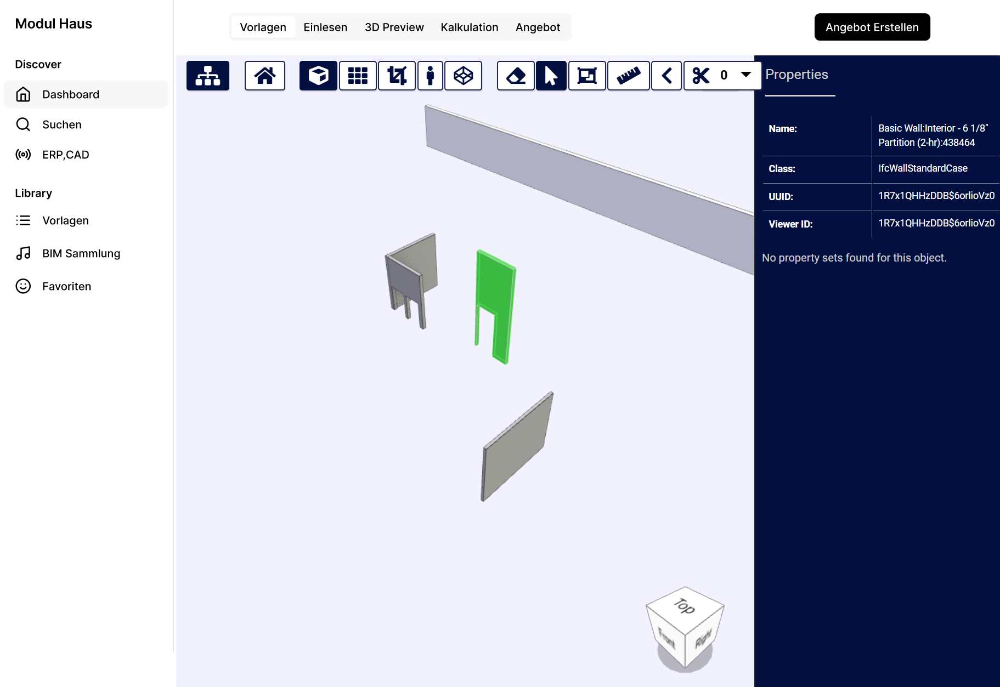
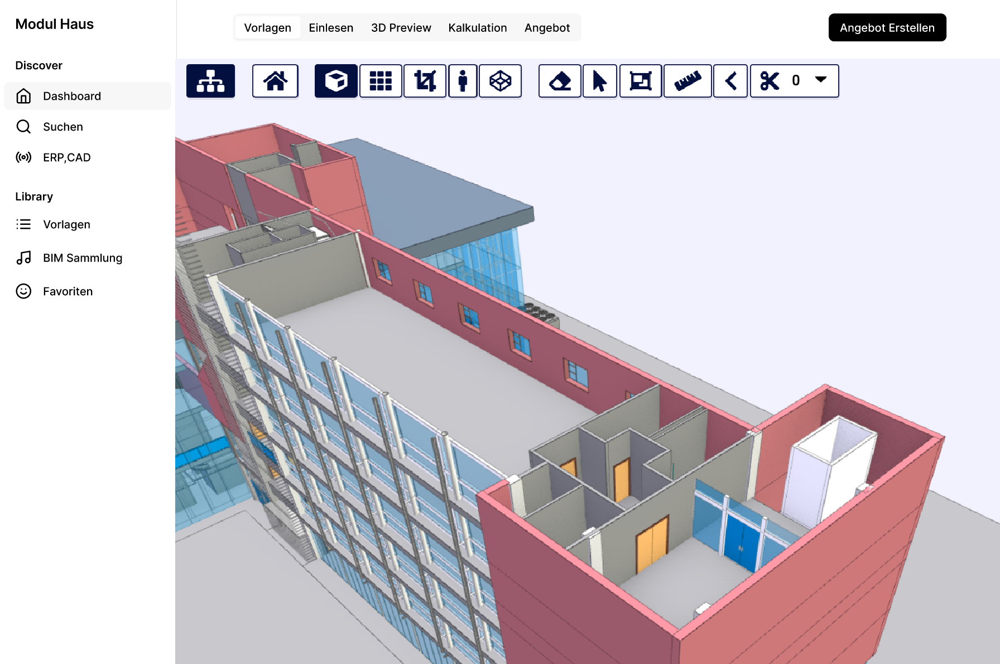

# UI Journey: Einlesen/Match

Diese Bilderstrecke zeigt den Prozess des Einlesens und Matchings von Gebäudeplänen im System.

## 1. Plan Einlesen

Der erste Schritt ermöglicht das Einlesen von Gebäudeplänen. Die Benutzeroberfläche bietet eine übersichtliche Ansicht mit:
- Einer Vorschau des eingelesenen Plans
- Informationen zum Dokument und dessen Status
- Möglichkeit zur Bearbeitung und Validierung der eingelesenen Daten

## 2. Module Übersicht

In der Modulübersicht werden die verfügbaren Baumodule dargestellt:
- Klare Visualisierung der einzelnen Module
- Detaillierte Informationen zu jedem Modul
- Filtermöglichkeiten zur besseren Übersicht
- Status und Eigenschaften der Module auf einen Blick

## 3. Gebäude Konfiguration

Die finale Ansicht zeigt die Gebäudekonfiguration:
- Gesamtübersicht des konfigurierten Gebäudes
- Zusammenstellung der ausgewählten Module
- Prüfung der Kompatibilität
- Visualisierung des Gesamtprojekts

Diese Journey ermöglicht einen effizienten Workflow vom initialen Planeinlesen bis zur finalen Gebäudekonfiguration mit modularem Aufbau.
